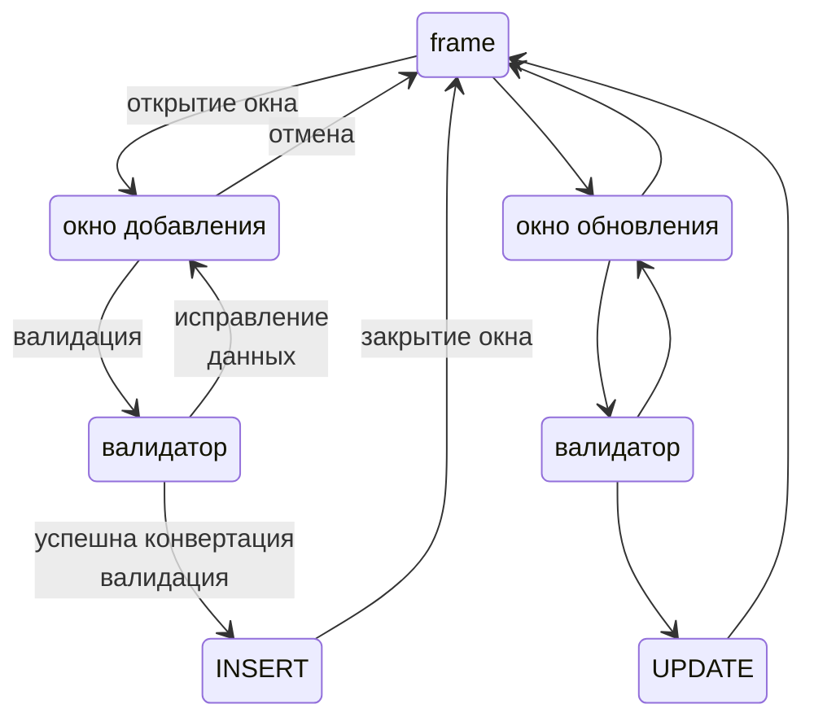
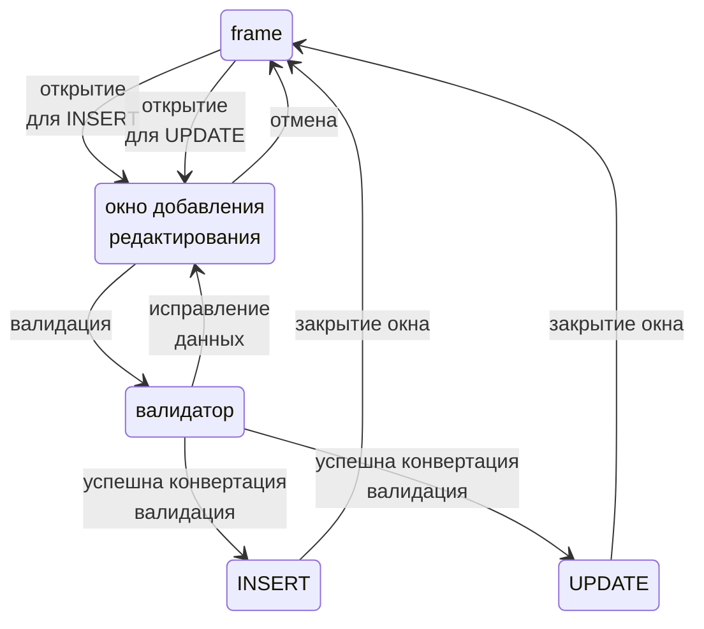

Операции над СУБД
=============================

Есть 4 типичных операции над данными называются CRUD

- C Create, оно же INSERT
- R Read, оно же SELECT
- U Update, оно же UPDATE
- D Delete, оно же DELETE

Для Delphi 7 (на сколько я плохо помню)
есть класс TADOQuery, 
но данный класс используется для перечисленный операций опосредованно.

Причина

- Есть дополнительные зависимости от VCL
- Для типичной операции SELECT недостает типизированной параметризации
    - Конфигурация части WHERE
    - Конфигурация части ORDER BY
- Для типичной операции INSERT более широкий тип возвращаемых данных
    - необходимо сузить тип до получения ID вставленной записи
- И т.д.

INSERT и UPDATE
--------------

Операции INSERT и UPDATE - подразумевают проверку входных данных и их конвертацию, перед выполнением их.

Соответственно выделены следующие классы в модуле `DMLOperation`

- TSqlInsertOperation - для выполнения операции INSERT
- TSqlUpdateOperation - для выполнения операции UPDATE

Работа с формами данных (модальными окнами) подразумевает следующую схему



Что бы не плодить лишних сущностей, открытие на редактирование (UPDATE) и добавление (INSERT) используется следующая схема



DELETE
-----------

Для операции DELETE нет необходимости валидировать данные, необходисо знать только id удаляемых записей.

В текущей реализации используется функции модулей `DBView`, `DBRowsSqlExec`, `DBRowPredicate`

Пример с водителями

    extend(driversDBGrid).fetchRows(true,false, rows.Add)

- driversDBGrid - содержит выбранные строки которые необходимо удалить
- fetchRows - делается выборка этих строк, и помещаются их копии в список строк rows

```
rows.Each(rowDelete.Execute);
```

выбранные строки удаляются, что бы задать сопоставления используется следующий код

    query := TADOQuery.Create(nil);
    query.Connection := driversADOQuery.Connection;
    query.SQL.Text := 'delete from drivers where [id] = :ID';

    rowDelete := TDBRowsSqlExec.Create(query);
    rowDelete.Map('id', 'id');

SELECT
----------------
В вопросе выборки данных [см это](select.md)