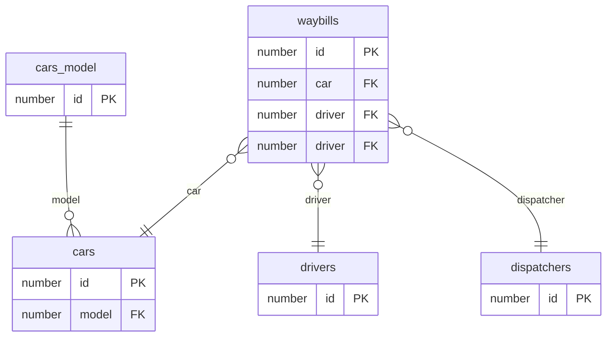
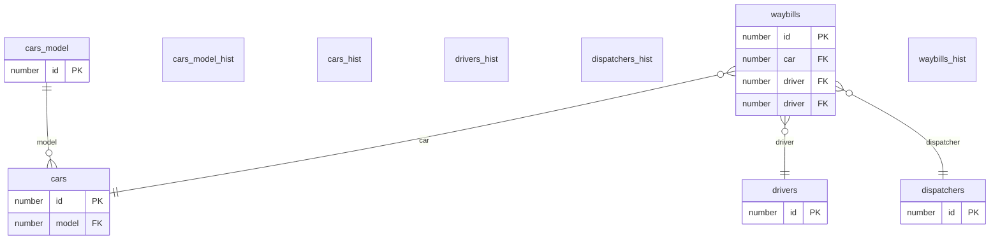

Модель данных
=====================

Есть 5 основныъ сущностей

- cars_model - модели машин 
- cars - машины
- drivers - водители
- dispatchers - диспетчера
- waybills - путевые листы

Логическая модель
----------------------

Физическая модель
------------------------------

waybills - путевые листы
------------------------------

Колонки

| колонка      | тип       | обязательно | PK/FK | FK таблица  | комментариии                                                                       |
|--------------|-----------|-------------|-------|-------------|------------------------------------------------------------------------------------|
| id           | int       | not null    | PK    |             | первичный ключ                                                                     |
| driver       | int       | not null    | FK    | drivers     | ссылка на водителя                                                                 |
| dispatcher   | int       | not null    | FK    | dispatchers | ссылка на диспетчера                                                               |
| car          | int       | not null    | FK    | cars        | ссылка на машину                                                                   |
| outcome_date | datetime2 | not null    |       |             | дата/время выезда                                                                  |
| income_date  | datetime2 | not null    |       |             | дата/время возврата                                                                |
| wear         | int       | not null    |       |             | пробег                                                                             |
| fuel_cons    | int       | not null    |       |             | потребеление топлива                                                               |
| ValidFrom    | datetime2 | not null    |       |             | актуальность записи, значения вставляются/обновляются автоматически MSSQL сервером |
| ValidTo      | datetime2 | not null    |       |             | актуальность записи, значения вставляются/обновляются автоматически MSSQL сервером |

- Поля ValidFrom, ValidTo - часть функциональности MSSQL - [Темпоральный таблицы](https://learn.microsoft.com/ru-ru/sql/relational-databases/tables/temporal-tables?view=sql-server-ver16)
    - Используются для поддержки истории изменений
    - Управляются самим MSSQL сервером
    - Связаны с исторической таблицей

Физически модель состоит из двух таблиц

- waybills - актуальные данные
- waybills_hist - исторические данные
    - структурно (названия колонок и типы) соответствует актуальной таблицу
    - если включен флаг SYSTEM_VERSIONING = ON, тогда - напрямую редактировать нельзя
    - продожительность хранения данных регулируется MSSQL сервером и настраивается администратором БД

drivers - Водители
------------------------------

Колонки

| колонка      | тип       | обязательно | PK/FK | FK таблица  | комментариии                                                                       |
|--------------|-----------|-------------|-------|-------------|------------------------------------------------------------------------------------|
| id           | int       | not null    | PK    |             | первичный ключ                                                                     |
| name | nvarchar(250) | not null | |  | имя / ФИО |
| birth_day | datetime2 | not null | | | дата рождения |
| ValidFrom    | datetime2 | not null    |       |             | актуальность записи |
| ValidTo      | datetime2 | not null    |       |             | актуальность записи |

- Поля ValidFrom, ValidTo - часть функциональности MSSQL - [Темпоральный таблицы](https://learn.microsoft.com/ru-ru/sql/relational-databases/tables/temporal-tables?view=sql-server-ver16)
    - Используются для поддержки истории изменений
    - Управляются самим MSSQL сервером
    - Связаны с исторической таблицей

Физически модель состоит из двух таблиц

- drivers - актуальные данные
- drivers_hist - исторические данные
    - структурно (названия колонок и типы) соответствует актуальной таблицу
    - если включен флаг SYSTEM_VERSIONING = ON, тогда - напрямую редактировать нельзя
    - продожительность хранения данных регулируется MSSQL сервером и настраивается администратором БД

dispatchers - Диспетчеры
------------------------------

Колонки

| колонка      | тип       | обязательно | PK/FK | FK таблица  | комментариии                                                                       |
|--------------|-----------|-------------|-------|-------------|------------------------------------------------------------------------------------|
| id           | int       | not null    | PK    |             | первичный ключ                                                                     |
| name | nvarchar(250) | not null | |  | имя / ФИО |
| birth_day | datetime2 | not null | | | дата рождения |
| ValidFrom    | datetime2 | not null    |       |             | актуальность записи |
| ValidTo      | datetime2 | not null    |       |             | актуальность записи |

- Поля ValidFrom, ValidTo - часть функциональности MSSQL - [Темпоральный таблицы](https://learn.microsoft.com/ru-ru/sql/relational-databases/tables/temporal-tables?view=sql-server-ver16)
    - Используются для поддержки истории изменений
    - Управляются самим MSSQL сервером
    - Связаны с исторической таблицей

Физически модель состоит из двух таблиц

- drivers - актуальные данные
- drivers_hist - исторические данные
    - структурно (названия колонок и типы) соответствует актуальной таблицу
    - если включен флаг SYSTEM_VERSIONING = ON, тогда - напрямую редактировать нельзя
    - продожительность хранения данных регулируется MSSQL сервером и настраивается администратором БД

cars - Машины
------------------------------

Колонки

| колонка      | тип       | обязательно | PK/FK | FK таблица  | комментариии                                                                       |
|--------------|-----------|-------------|-------|-------------|------------------------------------------------------------------------------------|
| id           | int       | not null    | PK    |             | первичный ключ                                                                     |
| legal_number | nvarchar(250) | not null | | | Гос номер |
| model | int | not null  | FK | cars_model | ссылка на модель |
| wear | int | not null | | | пробег |
| birth_year | int | not null | | | год выпуска |
| maintenance | datetime2 | nullable | | | Дата прохождения ТО |
| ValidFrom    | datetime2 | not null    |       |             | актуальность записи |
| ValidTo      | datetime2 | not null    |       |             | актуальность записи |

- Поля ValidFrom, ValidTo - часть функциональности MSSQL - [Темпоральный таблицы](https://learn.microsoft.com/ru-ru/sql/relational-databases/tables/temporal-tables?view=sql-server-ver16)
    - Используются для поддержки истории изменений
    - Управляются самим MSSQL сервером
    - Связаны с исторической таблицей

Физически модель состоит из двух таблиц

- cars - актуальные данные
- cars_hist - исторические данные
    - структурно (названия колонок и типы) соответствует актуальной таблицу
    - если включен флаг SYSTEM_VERSIONING = ON, тогда - напрямую редактировать нельзя
    - продожительность хранения данных регулируется MSSQL сервером и настраивается администратором БД

cars_model - Модель машины
------------------------------

Колонки

| колонка      | тип       | обязательно | PK/FK | FK таблица  | комментариии                                                                       |
|--------------|-----------|-------------|-------|-------------|------------------------------------------------------------------------------------|
| id           | int       | not null    | PK    |             | первичный ключ                                                                     |
| name | nvarchar(250) | not null | | | Название |
| maintenance | datetime2 | nullable | | | Дата прохождения ТО |
| ValidFrom    | datetime2 | not null    |       |             | актуальность записи |
| ValidTo      | datetime2 | not null    |       |             | актуальность записи |

- Поля ValidFrom, ValidTo - часть функциональности MSSQL - [Темпоральный таблицы](https://learn.microsoft.com/ru-ru/sql/relational-databases/tables/temporal-tables?view=sql-server-ver16)
    - Используются для поддержки истории изменений
    - Управляются самим MSSQL сервером
    - Связаны с исторической таблицей

Физически модель состоит из двух таблиц

- cars_model - актуальные данные
- cars_model_hist - исторические данные
    - структурно (названия колонок и типы) соответствует актуальной таблицу
    - если включен флаг SYSTEM_VERSIONING = ON, тогда - напрямую редактировать нельзя
    - продожительность хранения данных регулируется MSSQL сервером и настраивается администратором БД
