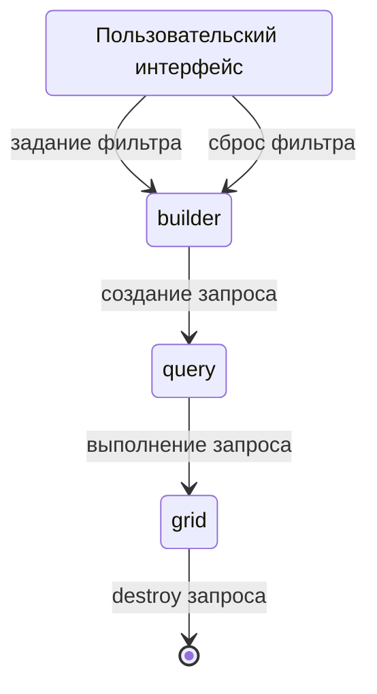
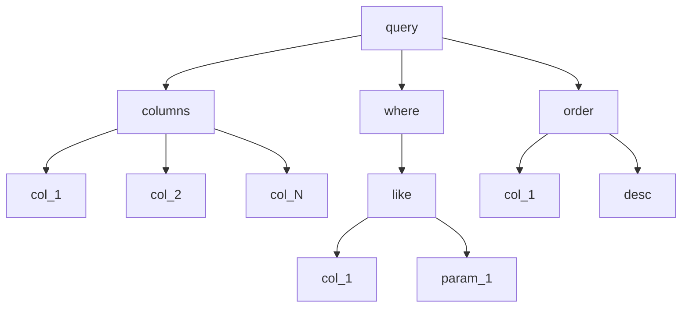

SELECT модель
======================

В Delphi 7 есть компонент TADOQuery
который можно использовать для выполнения запросов.

Данный момент минимально функционален, он оперирует двумя понятиями

- Запрос SQL - обычный плоский текст plain, не объект со сложной структурой
- Параметры - пары ключ-значение

Если понадобиться выполнять операции как фильтрация и сортировка, то обозначенных понятий будет не достаточно. Необходимо более сложное описание

- Список выбираемых колонок с выражениями SQL: `выражение_SQL AS синоним_колонки`
- Дерево выражения части WHERE
- Список указывающий на порядок сортировки

При этом необходимо соблюдение дополнительные условий:

- колонки между собой используемые в разных частях (список колонок, where, order) должны быть согласованы
- дерево where так же должно поддерживать параметры

В связи с этим вводиться понятие запрос (`IWaybillsQuery`) который содержит

- Колонки задаются массивом элементов класса `TWaybillColumn`
- Условие фильтрации (WHERE) задаются классами
    - Классы
        - `TWhereAndExpression` - задает операцию AND между двумя выражениями
        - `TWhereOrExpression` - задает операцию OR между двумя выражениями
        - `TWhereLikeExpression` - задает операцию LIKE между колонкой и параметром
    - Объекты данных классов могут между собой комбинироваться составляя дерево выражения WHERE
- Сортировка в данной реализации представлена опциональным объектом
    - указывает на сортируемую колонку
    - порядок сортировки

Данный объект (запрос) строиться через объект класса `TWaybillsQueryBuilder`.

Объект `TWaybillsQueryBuilder` внутри себя хранит состояние (что фильтровать, как сортировать) который содержит метод `build`.

Состояние объекта `TWaybillsQueryBuilder` меняется через пользовательский интерфейс.

Схематично отношения можно  представить так

Внутренняя структура запроса

